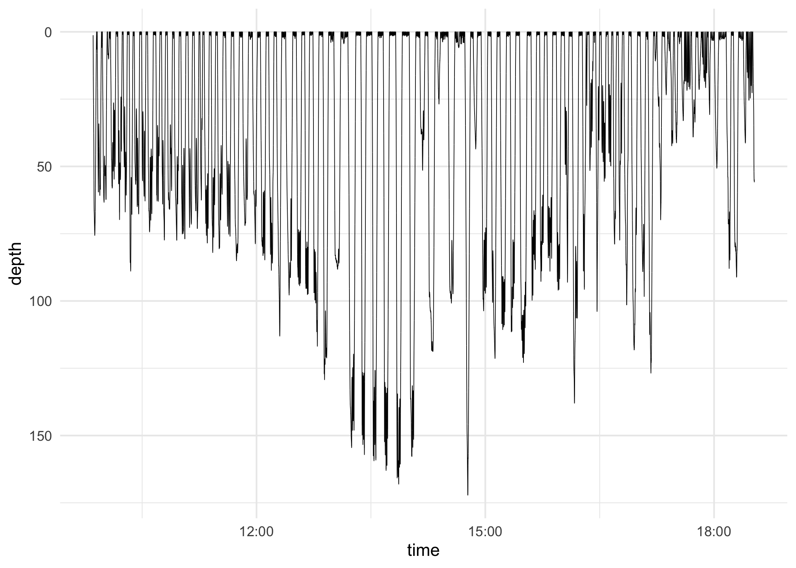
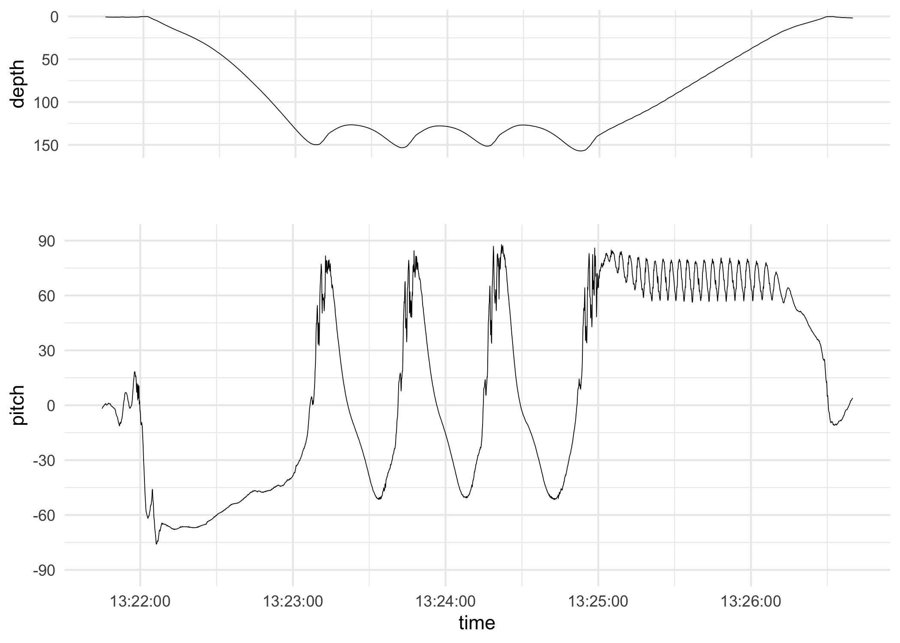

<!-- README.md is generated from README.Rmd. Please edit that file -->
prhdata
=======

prhdata provides R-ready pitch-roll-heading data collected from a humpback whale. These data were published in Cade, D. E., Barr, K. R., Calambokidis, J., Friedlaender, A. S. and Goldbogen, J. A. (2018). Determining forward speed from accelerometer jiggle in aquatic environments. Journal of Experimental Biology 221, jeb170449. The original data are in Matlab files available at <https://purl.stanford.edu/gd922zq9141>.

Installation
------------

You can install the released version of prhdata from [CRAN](https://CRAN.R-project.org) with:

``` r
install.packages("prhdata")
```

Example
-------

Plot a depth profile:

``` r
library(prhdata)
library(ggplot2)

ggplot(prh, aes(time, depth)) +
  geom_line(size = 0.2) +
  scale_y_reverse() +
  theme_minimal()
```



Plot pitch during a dive:

``` r
suppressMessages(library(cowplot))
dive <- prh[126200:129150, ]
depth_plot <- ggplot(dive, aes(time, depth)) +
  geom_line(size = 0.2) +
  scale_y_reverse() +
  theme_minimal() +
  theme(axis.text.x = element_blank(),
        axis.title.x = element_blank())

pitch_plot <- ggplot(dive, aes(time, pitch)) +
  geom_line(size = 0.2) +
  scale_x_datetime(date_labels = "%H:%M:%S") +
  scale_y_continuous(
    breaks = seq(-pi / 2, pi / 2, length.out = 7),
    labels = c(-90, -60, -30, 0, 30, 60, 90)
  ) +
  expand_limits(y = c(-pi / 2, pi / 2)) +
  theme_minimal()

plot_grid(depth_plot, pitch_plot, align = "h", ncol = 1, rel_heights = c(1, 2))
```


